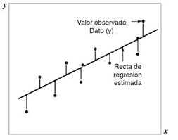

## Ejercicio - Regresión lineal 

- Este repositorio muestra un ejemplo de un Jupyter Notebook que encuentra un modelo de regresión lineal para un conjunto de observaciones

**NOTA:** Esta plantilla **no está diseñada para pruebas locales ni para Autograding**.
